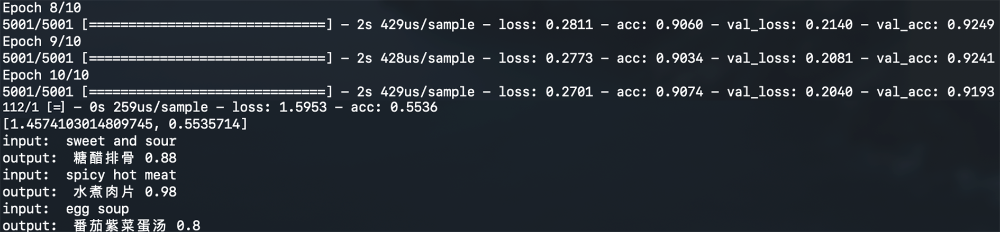

# FoodClassification

1. Download and unarchive [GloVe](https://nlp.stanford.edu/projects/glove/) to the folder
2. Install python package: 
   - tensorflow
   - sklearn
   - nltk (also nltk.downlaod(stopwords))
   - googletrans (option)
   - web (option)
3. Set your path and token(option)
4. Run **python nlp.py** to train data
5. Run **python main.py 80** to set a connect to WeChat

### Screenshot

- input: food description like name,taste and material
- output: food name and possibility